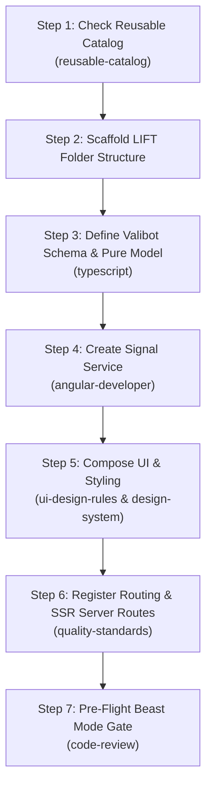

# 🚀 New Feature Master Lifecycle & Scaffolding Guide

This skill governs the **end-to-end architecture** for creating new features, pages, or modules in Atteya Store. It ensures every feature is built right from the start, prevents bloated components, and links into specialized guardrails.

---

## 🧭 The Feature Lifecycle at a Glance

When instructed to create or extend a feature, execute these 8 steps in order:



---

## 📂 Step 1: Check Existing Building Blocks First
>
> 👉 **Delegate to**: [reusable-catalog](file:///.agents/skills/reusable-catalog/SKILL.md)

Before writing any new component, service, dialog, form control, or CSS utility:

1. Open the [reusable-catalog](file:///.agents/skills/reusable-catalog/SKILL.md).
2. Check if an existing component (`src/app/shared/ui/`), extracted class (`src/styles/tailwind/components/`), or service (`DrawerService`, `SnackbarService`) already handles this need.
3. If a UI pattern repeats 2 or more times, follow the **2+ Duplication Rule** in [reusable-catalog](file:///.agents/skills/reusable-catalog/SKILL.md) to extract it.

---

## 📁 Step 2: Strict LIFT Folder Structure

Feature code lives exclusively inside `src/app/features/[feature-name]/`. Never dump files into a single root folder.

```text
src/app/features/[feature-name]/
├── schemas/
│   └── [feature].schema.ts          # Valibot schemas (validation & parsing)
├── models/
│   └── [feature].model.ts           # Pure TypeScript types inferred from schemas
├── services/
│   ├── [feature].service.ts         # Backend/Firestore @Service() (fetching, mutation)
│   └── [feature]-draft.service.ts   # Local UI State @Service() (staged draft mutations, reordering)
├── utils/
│   ├── [feature].utils.ts           # Pure functions (slugify, formatters, path builders)
│   └── [feature].validator.ts       # Decomposed validator functions (Cognitive Complexity <= 10)
├── dialogs/                         # Feature-specific dialog modals
├── components/                      # Dumb / presentation sub-components (born from Day 1)
│   └── [sub-feature]/
│       ├── [sub-feature].component.ts
│       └── [sub-feature].component.html
├── pages/
│   └── [feature]-page/              # Routed smart shell (orchestration ONLY, <= 100 lines)
│       ├── components/              # Page presentation sub-components
│       ├── dialogs/                 # Modals & confirmation dialogs
│       ├── services/                # Local draft & dialog orchestration services
│       ├── utils/                   # Page-specific pure helpers & validators
│       ├── [feature]-page.component.ts
│       └── [feature]-page.component.html
└── [feature].routes.ts              # Feature child routes
```

### 🏛️ The 4 Core Clean-Architecture Guardrails

1. **The 100-Line Component Budget**:
   - Routed page components (`pages/`) are **strictly shells / orchestrators** ($\le 100$ lines HTML, $\le 120$ lines TS).
   - Any visual region $\ge 40$ lines or containing its own actions/drag-drop (e.g. sidebars, lists, forms, toolbars) **MUST be created as a sub-component in `components/` right from the start**. Never dump monolithic markup into a page to refactor later.

2. **Local Feature Draft State Store (`services/`)**:
   - When a page has staged edits (drafts, CDK drag-drop reordering, adding/deleting items before committing to Firestore), **NEVER place array mutations inside the component class**.
   - Encapsulate reactive draft signals (`draftItems`, `isDirty`, `selectedId`) and mutation methods inside a dedicated local `@Service()` (e.g. `[feature]-draft.service.ts`).

3. **Cognitive Complexity & Pure Utilities (`utils/`)**:
   - Keep function Cognitive Complexity strictly $\le 15$ (ideally $\le 10$).
   - Never write triple-nested validation loops in component methods. Extract them into pure single-purpose functions in `[feature].validator.ts`.
   - Extract string manipulation, URL/slug generation, and normalization into pure functions in `[feature].utils.ts`.

4. **Symmetrical Layout Structure**:
   - When designing layout shells (e.g. `features/admin/layout/`):
     - `sidebar/`: Desktop sidebar sub-component
     - `header/`: Desktop topbar sub-component
     - `mobile-nav/`: Mobile bottom nav and slide-up drawer sub-components
     - The layout root component is strictly a container wiring viewports and responsiveness.

---

## 🛡️ Step 3: Valibot Schema & Pure TypeScript Model
>
> 👉 **Delegate to**: [typescript](file:///.agents/skills/typescript/SKILL.md)

1. **Schema (`schemas/[feature].schema.ts`)**:
   - Pipe external data through `v.safeParse()`.
   - Never use `v.optional(v.boolean(), false)` if incoming data may omit the field (prevents `InferOutput` requiring boolean).
   - Use pointer factories for nested objects and arrays.
   - Guard strings against ReDoS: use `v.pipe(v.string(), v.trim())`.

2. **Model (`models/[feature].model.ts`)**:
   - Derive models using `InferOutput`:

     ```typescript
     import * as v from 'valibot';
     import { ProductSchema } from '../schemas/product.schema';

     export type Product = v.InferOutput<typeof ProductSchema>;
     ```

   - All domain interfaces must be `readonly`.

---

## ⚡ Step 4: Signal-First Service
>
> 👉 **Delegate to**: [angular-developer](file:///.agents/skills/angular-developer/SKILL.md)

- Use `@Service()` from `@angular/core` (never legacy `@Injectable({ providedIn: 'root' })`).
- Use Native Firebase JS SDK (`getDoc`, `getDocs`, `onSnapshot`) or `HttpClient`. Zero `@angular/fire`.
- Resource-first data fetching:
  - Promises: `resource({ request: ..., loader: ... })`
  - Observables/Firestore real-time listeners: `rxResource()`
- Dynamic queries: feed directly into Signals. Zero manual `isLoading = signal(false)`.

---

## 🎨 Step 5: Compose UI & Styling
>
> 👉 **Delegate to**: [ui-design-rules](file:///.agents/skills/ui-design-rules/SKILL.md) and [design-system](file:///.agents/skills/design-system/SKILL.md)

1. **Component Selection Matrix**:
   - Form inputs -> `<app-text-input>`, `<app-select-input>`, etc. (Signal Forms).
   - Action buttons -> `<button matButton="...">` or `<button matIconButton>`.
   - Structural layout -> Native HTML (`<section>`, `<article>`, `<header>`, `<div>`) + Tailwind v4.
2. **Hard Bans**:
   - **ZERO Tailwind classes on Angular Material components**.
   - No raw colors (`bg-red-500`, `text-emerald-400`). Use semantic M3 tokens (`bg-primary`, `bg-surface`, `text-on-surface`, `bg-success`).
   - Suffix `!` (`hidden!`, never `!hidden`).
   - `size-{N}` instead of `w-{N} h-{N}`.
3. **Template Access**:
   - Template members can be `private`.
   - Angular v22 defaults: do NOT write `standalone: true` or `ChangeDetectionStrategy.OnPush`.

---

## 🧭 Step 6: Routing & SSR Server Routes Registration
>
> 👉 **Delegate to**: [quality-standards](file:///.agents/skills/quality-standards/SKILL.md)

1. **Feature Routes (`[feature].routes.ts`)**:
   - Route state flows as `input()` into components (enabled by `withComponentInputBinding()`).
   - Lazy load routes: `loadComponent: () => import(...)`.
2. **Dynamic Route SSR Registration (`src/app/app.routes.server.ts`)**:
   - ⚠️ **MANDATORY**: If the feature introduces parameterized routes (e.g. `path: 'category/:slug'`) or wildcard routes, you **MUST** register them in `src/app/app.routes.server.ts` with `RenderMode.Server` (or provide `getPrerenderParams`).
   - Failure to do this will crash `npm run build` during static prerendering!

---

## 🏁 Step 7: Pre-Flight Beast Mode Gate
>
> 👉 **Delegate to**: [code-review](file:///.agents/skills/code-review/SKILL.md)

Before marking any feature as complete:

1. Run `npm run preflight` to verify zero errors across project rules and ESLint (`node scripts/pre-flight-check.mjs && eslint .`).
2. Run `npm run build` to verify SSR prerendering passes with code 0.
3. Run the **Golden 7-Point Audit** in [code-review](file:///.agents/skills/code-review/SKILL.md).
